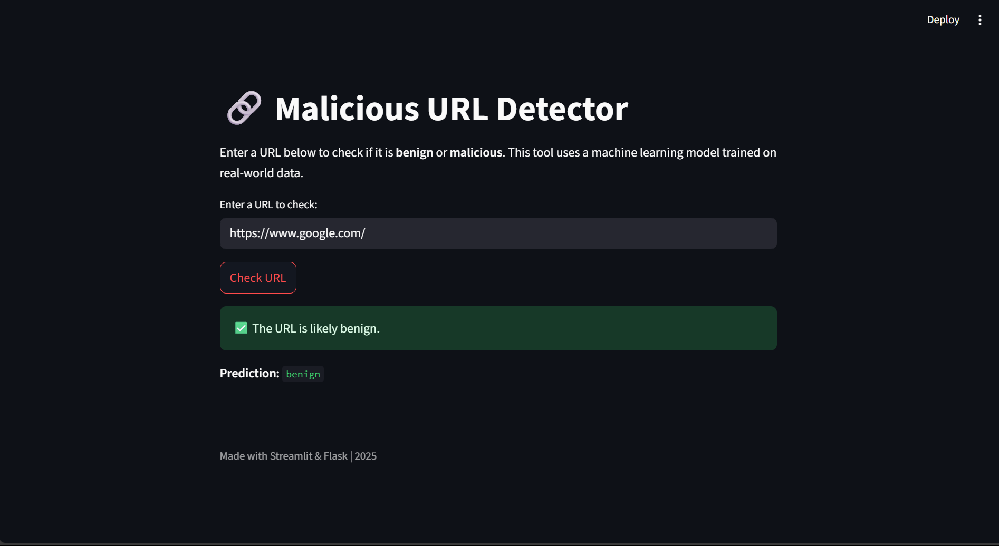

# Malicious URL Detector
# 🔐 Malicious URL Detector

This project is a machine learning-based web application that detects whether a given URL is **benign** or **malicious**. It uses trained models to classify URLs into categories such as:
- Benign
- Malware
- Phishing
- Defacement

Built with:
- 🐍 Python
- 🧠 Scikit-learn (ML model)
- 🌐 Flask (backend API)
- 🎈 Streamlit (frontend UI)

---

## 🚀 Features

- 🔍 Predicts if a URL is malicious or safe
- 🧠 Uses machine learning with extracted features
- 📊 Supports four classes of URL threats
- 🖥️ Streamlit-based user interface
- 🧪 Flask API for backend model prediction
- ✅ User-friendly and fast response

---

## 📁 Project Structure
```bash
malicious-url-detector/
├── app.py # Flask backend API
├── feature_extraction.py # Feature extraction functions
├── model.pkl # Trained ML model
├── requirements.txt # Project dependencies
├── streamlit_app.py # Streamlit frontend
├── url_detector.ipynb # Jupyter notebook for training and testing
├── dataset/ # Dataset used for training
│ └── urls.csv
├── .gitignore
└── README.md
 ```

---

## 🧠 ML Model

- **Algorithm Used**: Random Forest Classifier (you can mention if it's another)
- **Training Data**: Public dataset with labeled URLs
- **Feature Extraction**: Based on lexical properties of the URL like:
  - URL length
  - Number of dots, special characters
  - Presence of IP address
  - Use of HTTPS or HTTP
  - Suspicious words (e.g., login, verify, update)

---
## 📥 Dataset

We used a publicly available dataset of malicious and benign URLs for training.

- Dataset source: [Kaggle - Malicious URLs Dataset](https://www.kaggle.com/datasets/sid321axn/malicious-urls-dataset)
- Note: Due to licensing and size constraints, the dataset is not included in this repo. Please download it manually and place it in the `dataset/` folder before training or running the model.

## Screenshot


## 🖥️ How to Run

### 🔧 Prerequisites

- Python 3.8+
- pip
- Git

### ⚙️ Setup

1. Clone the repository:
   ```bash
   git clone https://github.com/thara-ttt/Malicious-url-detector.git
   cd malicious-url-detector
   ```
2.  Create a virtual environment and activate it:
   ```bash
    python -m venv venv
    venv\Scripts\activate   # On Windows
    source venv/bin/activate  # On macOS/Linux
   ```
3.  Install dependencies:
   ```bash
    pip install -r requirements.txt
  ```
4.  Run the Flask backend:
   ```bash
    python app.py
  ```
5.  In a new terminal, run the Streamlit frontend:
   ```bash
    streamlit run streamlit_app.py
  ```
